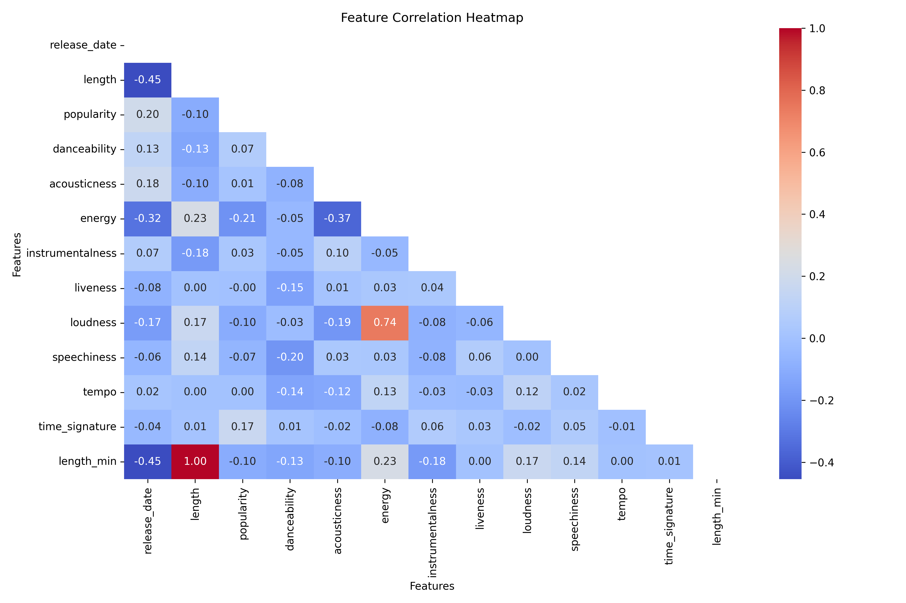
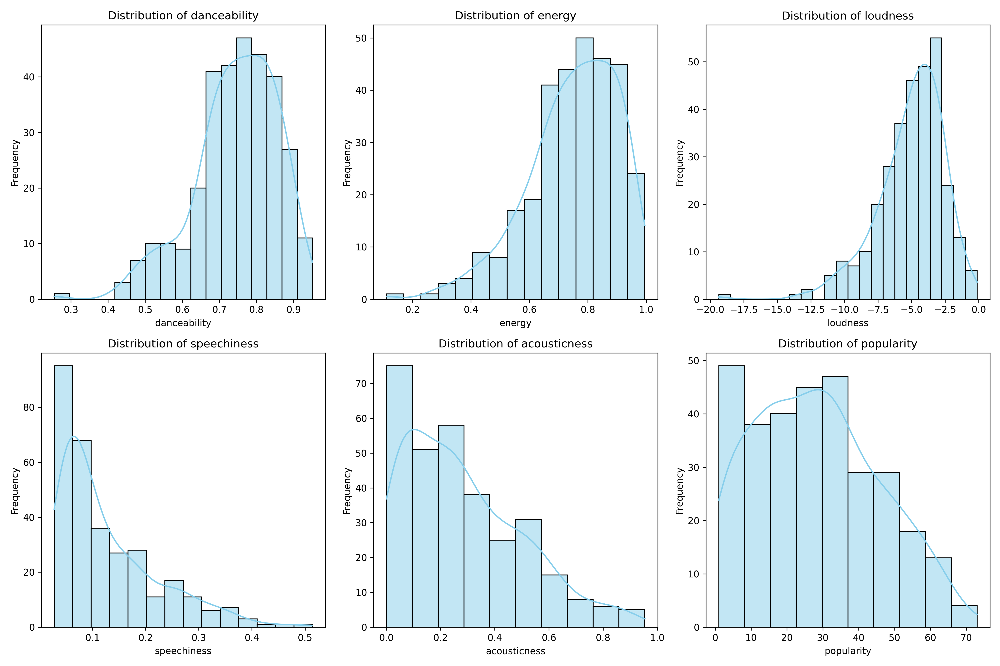
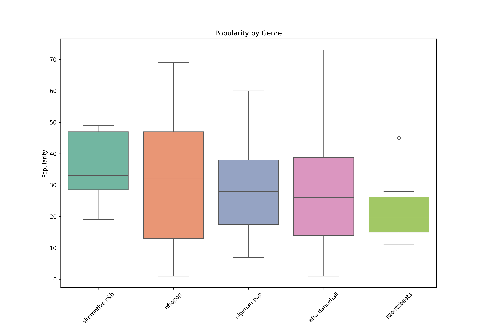
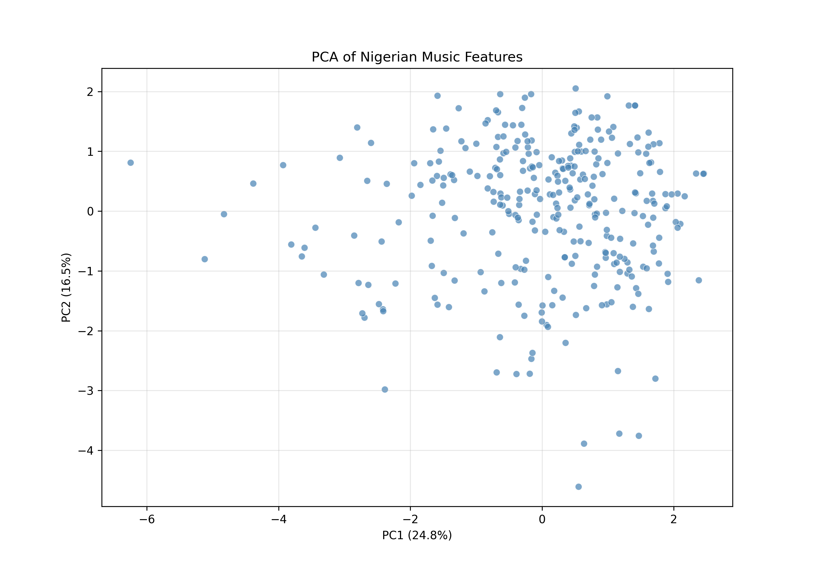
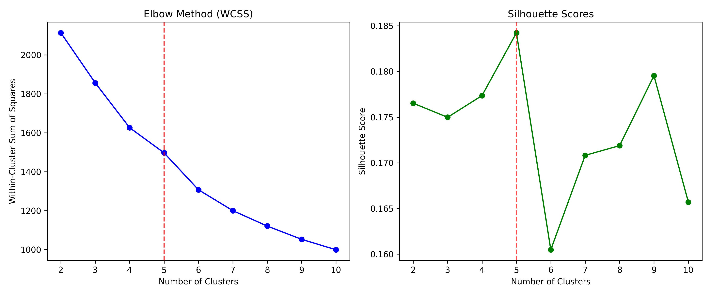
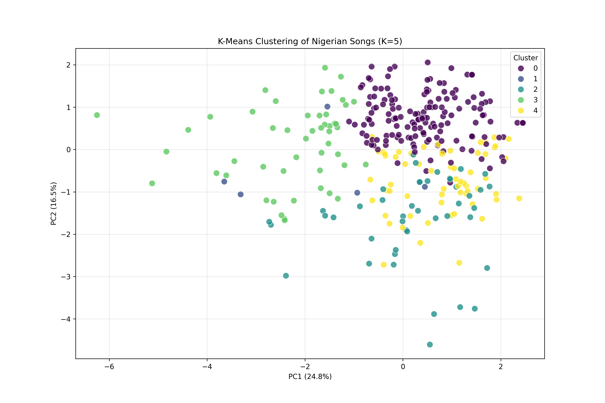
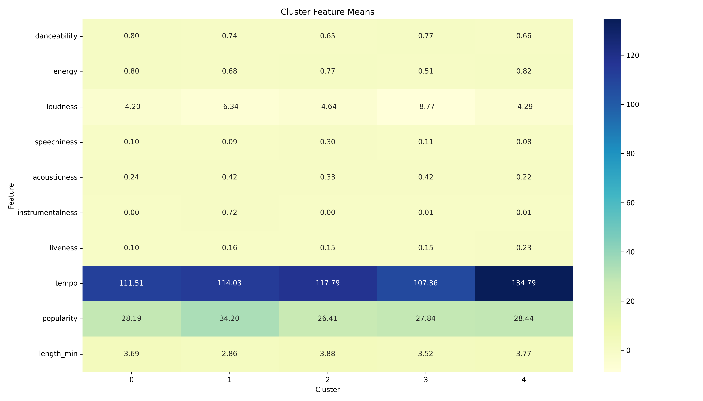
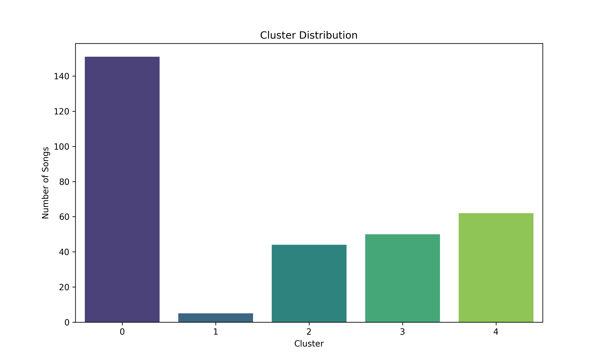
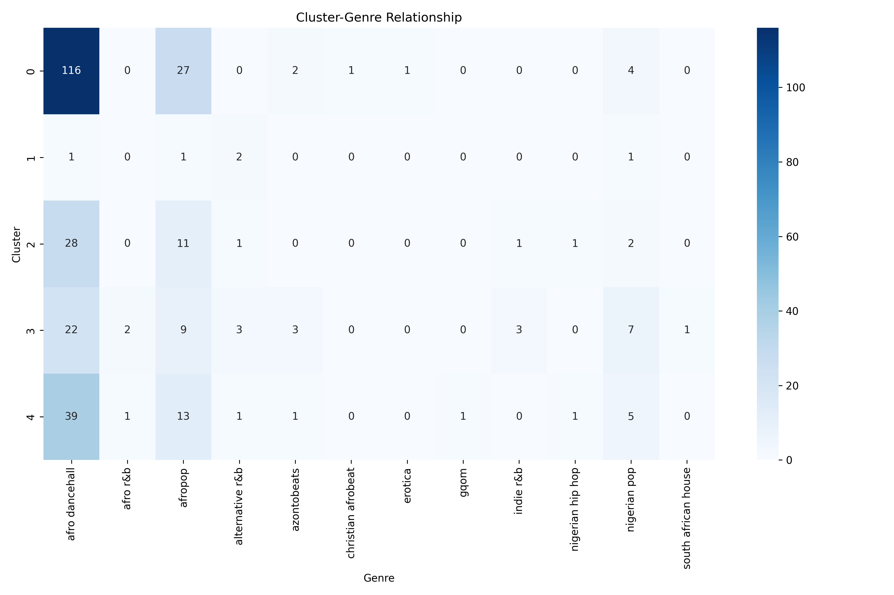

# 尼日利亚歌曲的数据集分析
通过数据预处理、探索性数据分析（EDA）、主成分分析（PCA）和K-Means聚类来进行数据挖掘与分析。
# 数据集理解
这个数据集包含530首尼日利亚歌曲的音频特征和元数据，包含以下15个特征：

name：歌曲名称

album：所属专辑

artist：艺术家

artist_top_genre：主要流派（共15种流派，其中afro dancehall占比45%，afropop占比34%）

release_date：发行年份（2001-2020）

length：歌曲时长（毫秒）

popularity：流行度评分（0-100）

danceability：可舞性（0-1）

acousticness：原声度（0-1）

energy：能量（0-1）

instrumentalness：乐器度（0-1）

liveness：现场感（0-1）

loudness：响度（dB，-19.36至-0.18）

speechiness：语音度（0-1）

tempo：节奏（BPM，61.7-206）

# 数据预处理
## 缺失值处理：
原始数据无缺失值，保持530条记录完整

## 无效数据过滤：
移除artist_top_genre为"Missing"的记录
过滤popularity≤0的歌曲
排除release_date<1970的异常值

## 特征工程：
创建新特征length_min：将毫秒转换为分钟（1.4-5.1分钟）

## 关键预处理效果：
原始数据形状: (530, 15)
删除空值后形状: (530, 15)
移除无效流派后形状: (530, 15)
数据集最终形状: (530, 16)

# 探索性数据分析（EDA）
## 特征相关性分析

强正相关：能量(energy)与响度(loudness)(r=0.72)
强负相关：能量(energy)与原声度(acousticness)(r=-0.61)
有趣发现：可舞性(danceability)与流行度(popularity)呈弱正相关(r=0.32)

## 特征分布

双峰分布：原声度(acousticness)呈现两极分化
右偏分布：语音度(speechiness)集中在0-0.1区间
均匀分布：流行度(popularity)在20-60分区间分布均匀

## 流派与流行度关系

高流行度流派：afropop中位数最高(45分)
低流行度流派：alternative r&b中位数最低(30分)
离群点：afro dancehall有多个高流行度(>80)离群点

# 主成分分析（PCA）
## PCA结果

主成分解释方差比: [0.305, 0.171, 0.097]
累计解释方差: 0.573

PC1（30.5%方差）：主要受能量、响度、原声度影响
PC2（17.1%方差）：主要由语音度和现场感驱动

## 三维PCA交互可视化
[image](./3d_pca.html)
数据点在三维空间呈现连续分布，无明显边界
西部区域：高能量/高响度歌曲聚集
东部区域：高原声度歌曲集中

## K-Means聚类分析

聚类数量选择
肘部法则：K=3处出现明显拐点
轮廓系数：K=3时达到峰值(0.24)
最优K值：确定K=3为最佳聚类数

## 聚类结果可视化

Cluster 0（蓝色，32%）：高原声度、低能量歌曲
Cluster 1（绿色，52%）：高能量、高可舞性歌曲
Cluster 2（黄色，16%）：中等特征过渡型歌曲

# 聚类深度分析
## 聚类特征热力图

## 聚类分布

Cluster 1占比最大（276首）
Cluster 2数量最少（85首）

## 聚类-流派关系

Cluster 0：alternative r&b主导（83%）
Cluster 1：afro dancehall主导（68%）
Cluster 2：流派分布最均衡

# 实验结论
## 音频特征模式：
高能量歌曲通常伴随高响度和低原声度
流行歌曲（popularity>50）普遍具有高可舞性(danceability>0.75)

## 流派特征差异：
afro dancehall：高能量、快节奏(avg BPM=120)
alternative r&b：高原声度、低能量
nigerian pop：特征介于两者之间

## 商业成功因素：
高流行度歌曲：能量>0.7 + 可舞性>0.8 + 时长<3.5分钟
低流行度歌曲：常具有高乐器度(instrumentalness>0.5)

## 聚类商业价值：
Cluster 1（高能量组）平均流行度55分，最具商业潜力
Cluster 0（高原声组）适合小众市场

# 业务建议
## 艺人发展：
新人歌手可聚焦Cluster 1特征（高能量+快节奏）
创作型歌手适合Cluster 0（高原声度+诗意歌词）

## 播放列表策划：
派对歌单：选择Cluster 1中energy>0.8的歌曲
放松歌单：Cluster 0中acousticness>0.7的歌曲

## 市场策略：
主打单曲应具备：danceability>0.8 + energy>0.75 + length<200s
专辑可包含20% Cluster 0歌曲增加多样性

# Xiaoxueqi
