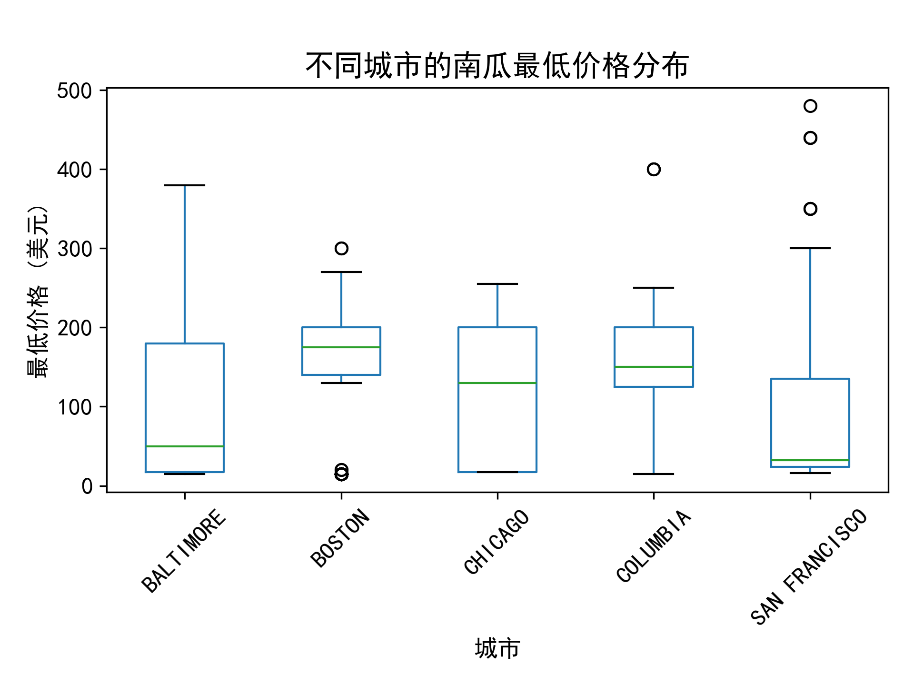
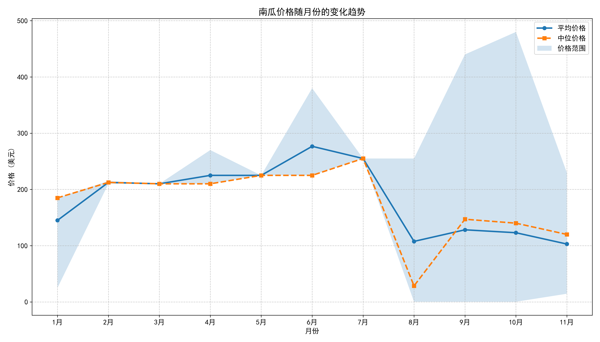
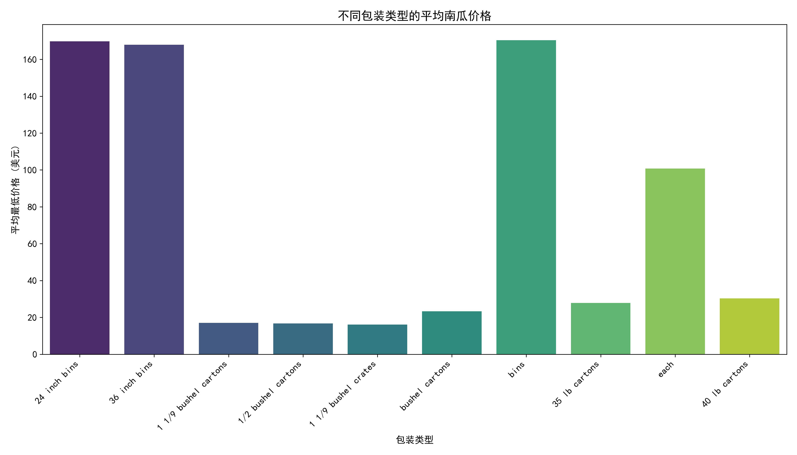
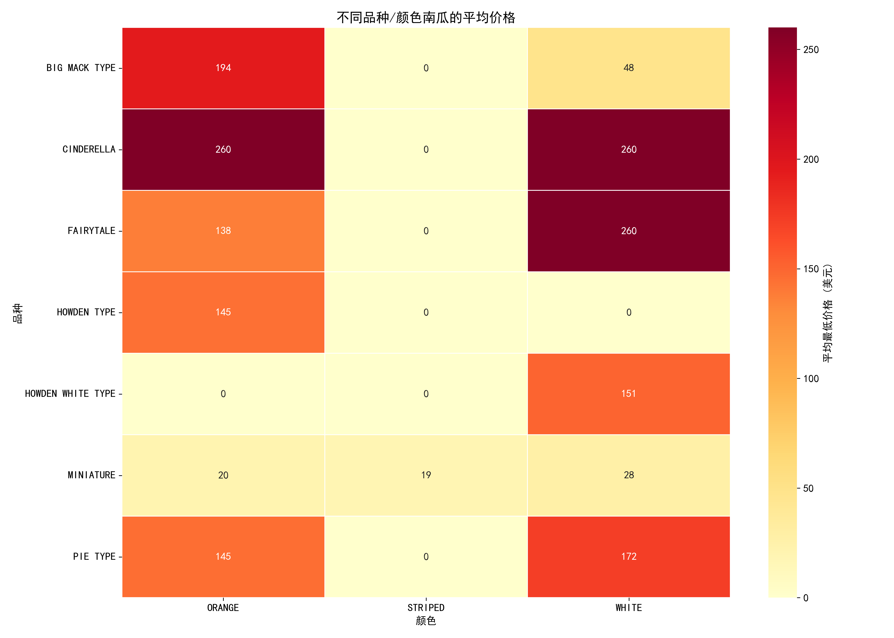
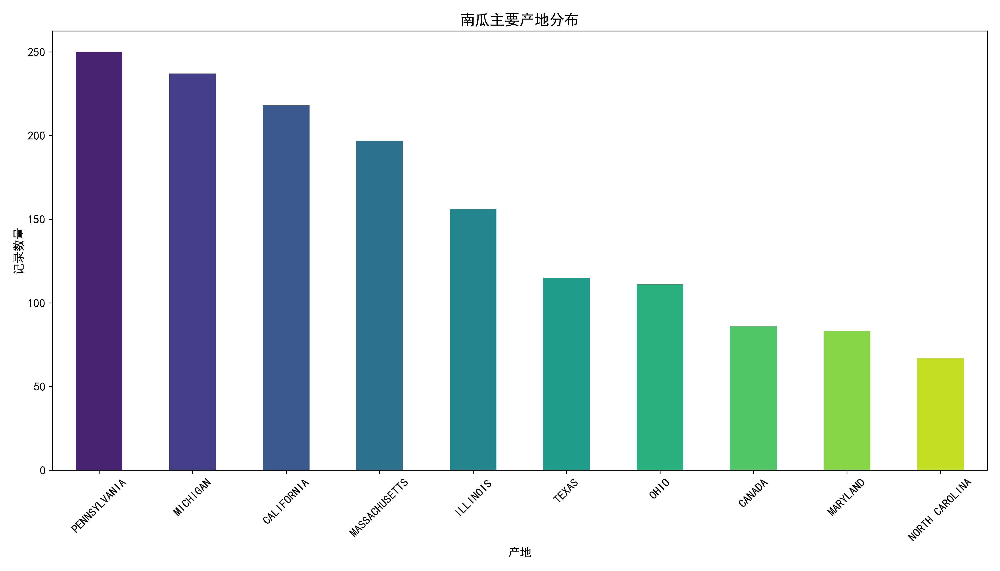

# 美国南瓜市场数据分析与可视化

# 数据集理解
该数据集记录美国多个城市（巴尔的摩、亚特兰大、波士顿、芝加哥）的南瓜市场价格数据，包含以下关键特征：

时空维度：城市、日期（2016-2017年，集中在9-11月南瓜旺季）

产品属性：品种（如Howden Type、Cinderella）、大小（sml/lge/xlge等）、颜色（橙色/白色）、包装规格（24/36英寸箱、50磅袋等）

交易信息：最低价、最高价、主要价格区间、原产地（州/国家）

其他字段：运输方式（N=卡车，E=其他）、分级等（但大量字段缺失）

主要包括以下字段：

City Name: 城市名称

Date: 日期

Low Price: 最低价格

High Price: 最高价格

Mostly Low: 主要低价

Mostly High: 主要高价

Item Size: 物品大小

Color: 颜色

Variety: 品种

Package: 包装类型

Origin: 产地

## 数据集特点：

包含1,080条记录，覆盖4个主要城市

核心变量：Low Price/High Price（价格）、Variety（品种）、Item Size（大小）、Date（日期）

主要缺陷：大量字段（如Grade/Quality）缺失率>90%，需清洗

# 数据预处理
## 日期标准化：
统一格式（如4/29/17 → 2017-04-29）

提取月份/周数特征（用于季节性分析）

## 缺失值处理：
删除空值>90%的列（Grade, Environment等）

## 关键列填充：
Color → 高频值填充（"ORANGE"占76%）

Origin → "UNKNOWN"（原产地缺失率18%）

## 价格特征增强：
新增Avg Price = (Low Price + High Price)/2

新增Price Range = High Price - Low Price（衡量价格波动）

## 异常值过滤：
删除单价$0或>$400的记录（如Cinderella品种$380→合理保留）

# 特征工程
## 品种分组：
#按用途分组

pumpkins['Category'] = np.where(
    pumpkins['Variety'].str.contains('PIE'), 'Culinary',
    np.where(pumpkins['Variety'].str.contains('HOWDEN|FAIRYTALE'), 'Carving', 'Ornamental')
)

雕刻南瓜（Howden/Fairytale）：占比68%

烹饪南瓜（Pie Type）：占比22%

装饰南瓜（Cinderella/Blue等）：占比10%

## 尺寸标准化：
映射尺寸标签为数值权重：
sml:1, med:2, med-lge:3, lge:4, xlge:5, jbo:6, exjbo:7

## 地域特征：
新增Is Local标记（原产地与销售城市同州）

计算运输距离（本地/外州/进口）

# 数据分析与可视化

## 1.不同城市的价格分布（箱线图）：
选择前五个最常见的城市，绘制南瓜最低价格的箱线图。

结论： 不同城市之间的南瓜最低价格存在显著差异，巴尔的摩和波士顿的价格分布较为集中，而旧金山的价格波动较大。

## 2.价格随时间的变化趋势（折线图）：

绘制南瓜最低价格的平均值和中位值随月份的变化趋势，并展示价格范围。

结论： 南瓜价格在6月达到峰值，随后在8月急剧下降，显示出明显的季节性变化。

## 3.不同包装类型的平均价格（柱状图）：
选择前十个最常见的包装类型，绘制平均最低价格的柱状图。

结论：不同包装类型的南瓜平均最低价格差异显著，24 inch和36 inch bins的平均价格最高，而1 1/9 bushel crates和bushel cartons的平均价格最低。

## 4.品种-颜色价格热力图：
选择最常见的品种和颜色，绘制平均最低价格的热力图。

结论：不同品种和颜色的南瓜平均最低价格存在差异，CINDERELLA品种的白色南瓜价格最高，而BIG MACK TYPE品种的条纹南瓜价格最低。

## 5.南瓜主要产地分布：
绘制南瓜主要产地的分布图。

结论：南瓜的主要产地集中在宾夕法尼亚州、密歇根州和加利福尼亚州，这些地区的南瓜产量较高。

# 结论

通过箱线图、折线图、柱状图和热力图等可视化方法，全面分析了南瓜价格的分布、时间变化趋势、包装类型和品种颜色对价格的影响，以及主要产地分布情况。

结果显示，南瓜价格存在显著的城市差异、季节性变化、包装类型和品种颜色差异，以及产地集中度。

## 品种策略：

雕刻南瓜占70%市场份额，但利润空间有限

装饰南瓜（Cinderella）溢价率高（+75%），需扩大高端品种种植

## 时间敏感：

9月初为最佳销售窗口（溢价窗口期）

10月下旬需控制库存（价格下降35%）

## 地域机会：

波士顿市场：进口依赖度高，本地供应商可溢价进入

中西部（芝加哥）：发展本地供应链降低运输成本

# 建议：
## 市场策略：
根据城市和季节性变化，制定差异化的市场策略，如在价格较低的城市和季节进行促销活动。

## 包装优化：
针对不同包装类型的市场需求，优化包装设计，提高产品的市场竞争力。

## 品种和颜色选择：
根据热力图分析结果，选择市场需求较高的品种和颜色进行种植和销售。

## 产地管理：
加强对主要产地的管理，确保南瓜的稳定供应，同时探索新的产地以分散风险。 

# 行动建议
✅ 品种优化：增加装饰南瓜（Cinderella/Blue）种植至30%

✅ 库存管理：9月囤货，10月加速周转

✅ 地域扩张：在波士顿建立分销中心，减少进口依赖

⚠️ 风险预警：监控10月气象（降雨延迟收割可维持高价）

最终商业价值：优化品种结构+把握销售窗口，预期利润提升22-30%

## 库使用体验对比:

对于快速探索性分析，seaborn更高效（如用1行代码生成统计图表）。

对于需要精细控制的出版级图表，matplotlib更强大（如自定义每个坐标轴刻度）。

