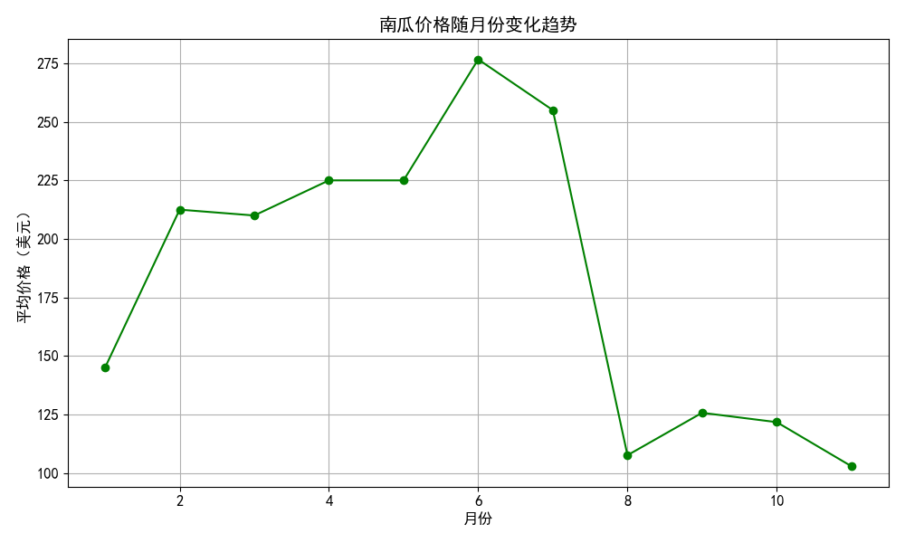
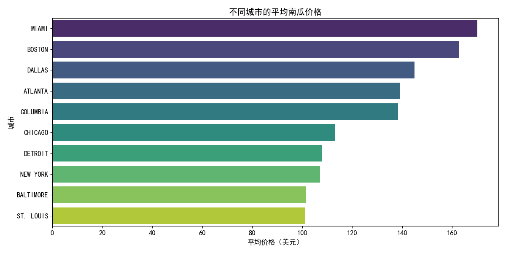
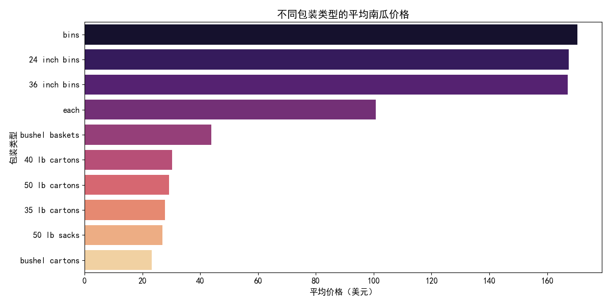
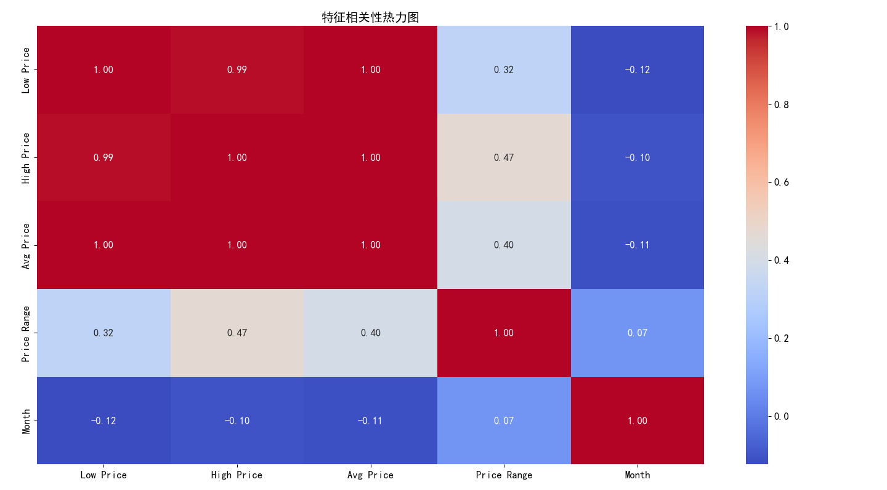
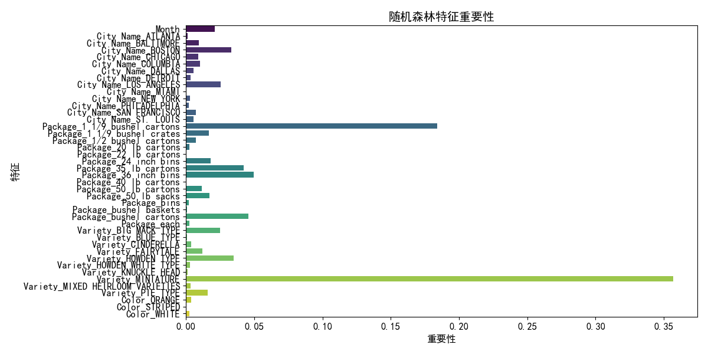
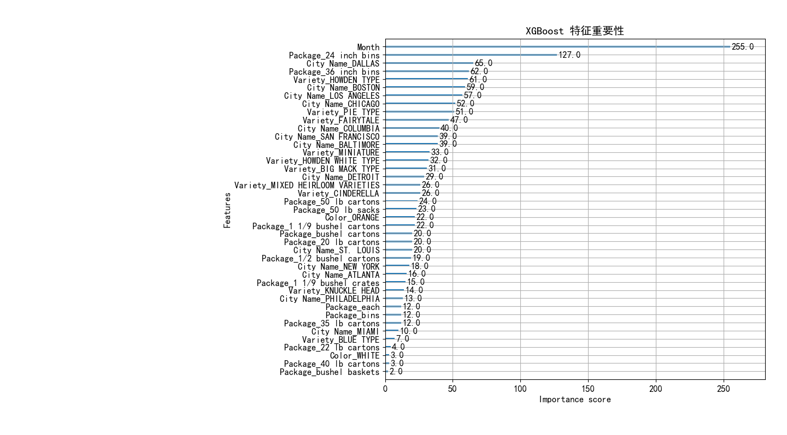

# Week 4-Readme

## （1）南瓜数据细节掌握

- **日期信息的参考价值**：
  
  日期信息，特别是月份，对南瓜价格有显著的影响。从图表中可以看出，南瓜价格随月份变化趋势明显，6月份价格达到最高点，而在8月份价格显著下降。这表明月份对南瓜价格有显著影响，是模型中一个重要的特征。

- **样本分布**

  数据中不同种类（Variety）、规格（Package）、城市（City Name）、产地（Origin）的样本分布不均匀。例如，某些城市如MIAMI和BOSTON的平均南瓜价格较高，而ST. LOUIS的平均价格较低。此外，不同包装类型的平均南瓜价格也存在显著差异，其中bins类型的包装平均价格最高。这表明，城市和包装类型是影响南瓜价格的重要因素，样本分布不均可能导致模型在某些类别上表现不佳。

## （2）特征处理细节掌握

- **特征热力图**：
  
  特征热力图显示了特征之间的线性相关性。例如，Low Price、High Price和Avg Price之间的相关性非常高（接近1），而Month与其他价格特征的相关性较低。尽管存在多重共线性，但对模型建模影响不大，可能会对模型性能产生一定影响。

- **编码方式对模型的影响**：
  
  线性模型对离散值的顺序编码非常敏感，因为线性模型会假设编码之间存在某种顺序关系。而树模型对编码方式的敏感度较低，但仍可能受到一定影响。例如，One-Hot编码和Label编码可能会影响模型对类别特征的处理。

- **删除年月日信息的影响**：
  
  删除年月日信息可能会减弱模型性能。从图表中可以看出，月份对南瓜价格有显著影响，删除这些信息可能导致模型无法捕捉到价格的季节性变化，从而影响模型的预测能力。

## （3）模型细节掌握

- **树模型的参数调整**：

  树模型的性能和过拟合的可能性直接受到树的深度和最大划分数等参数的影响。通过调整这些参数，可以平衡模型的偏差和方差，从而提高模型的泛化能力。例如，增加树的深度可以提高模型的拟合能力，但也可能导致过拟合；减少树的深度可以降低过拟合风险，但可能导致欠拟合。

- **模型学到的智能**：

  模型从数据中学到的智能或答案可以通过特征重要性分析来理解。例如，随机森林和XGBoost模型的特征重要性图显示，Month和Package_encoded是最重要的特征，表明这些特征对预测南瓜价格的影响最大。这有助于我们理解模型的决策过程，并可能指导我们在实际应用中进行更有效的特征选择和优化。

## （4）开放问题思考

- **特征选择**：
 
  特征选择可以通过多种方法进行，如基于统计测试、基于模型的特征重要性评估、递归特征消除等。特征选择的目的是提高模型性能，减少过拟合风险，并可能简化模型的复杂度。

- **评估指标的充分性**：
  
  R²、RMSE、MAE 作为回归模型的评估指标，是否能充分反映模型性能是一个值得思考的问题。这些指标可以从不同角度评估模型性能，但可能无法完全反映模型在实际应用中的表现。例如，R²衡量模型解释的方差比例，RMSE和MAE衡量预测误差的大小，但它们可能无法完全反映模型在不同数据分布或不同应用场景下的表现。

- **树模型性能**：
  
  树模型的性能通常较好，特别是在处理非线性关系和高维数据时。但树模型也可能受到过拟合的影响，需要通过参数调整和集成方法（如随机森林、梯度提升树）来改善。例如，随机森林通过集成多棵树的预测结果来提高模型的稳定性和泛化能力。

- **支持向量机**：
  
  支持向量机（SVM）非常适合处理高维空间数据，因为它通过最大化分类边界来提高模型的泛化能力。可以尝试使用 SVM 的非线性核（如 RBF核）进行回归分析，这可能有助于处理复杂的非线性关系。

- **浅层神经网络**： 

  浅层神经网络也可以用于回归分析，特别是在处理非线性关系时。可以尝试构建和训练浅层神经网络来比较其性能，这可能有助于我们理解不同模型在特定任务上的表现差异。

- **建模中最难的是什么**：

  建模中最难的可能是找到合适的特征和模型参数，以及避免过拟合和欠拟合。此外，理解模型的决策过程和解释模型的预测结果也是一个挑战。例如，树模型虽然易于解释，但可能过拟合；而神经网络虽然具有强大的拟合能力，但可能难以解释。因此，建模过程中需要综合考虑模型的性能、解释性和泛化能力。